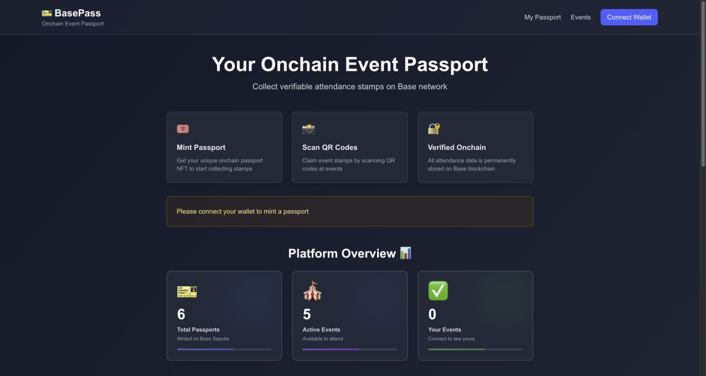

# BasePass



An onchain event-passport prototype that uses signed QR claims and replay protection to issue verifiable attendance stamps on Base.

Built as a solo hackathon project to explore smart-contract security, wallet-based identity, QR claim flows, and Web3 product design.

## What it demonstrates

- ERC-721 passport and event-stamp contracts
- ECDSA-signed attendance claims
- Nonce, expiration, ownership, and chain-ID checks
- Role-gated stamp minting
- Non-transferable passports and event stamps
- Next.js interface for passport, event, and claim flows

## How the claim flow works

```text
Organizer creates event
        ↓
Authorized signer creates a time-limited claim
        ↓
Attendee scans the QR code
        ↓
BasePass validates owner, signature, nonce, expiry, and chain
        ↓
EventStamp mints a non-transferable attendance record
```

## Stack

Solidity · Hardhat · OpenZeppelin · TypeScript · Next.js · wagmi · viem · Base Sepolia

## Run the contracts

```bash
npm install
npm test
```

The contract test suite covers deployment, passport minting, event creation, signed claims, ownership checks, and duplicate-claim prevention.

## Run the interface

```bash
cd frontend
npm install
npm run dev
```

Open `http://localhost:3000` and connect a compatible test wallet.

## Project status

BasePass is a learning and hackathon prototype deployed for Base Sepolia testing. The contracts have not received an independent security audit and should not be used with real assets.

## License

[MIT](LICENSE)
